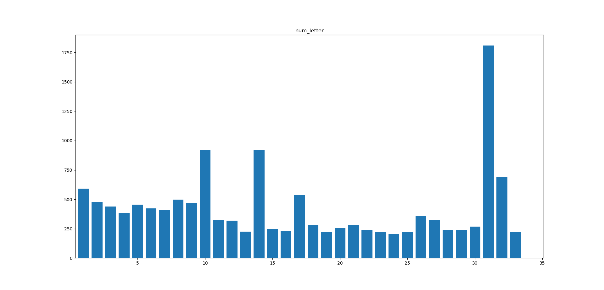

# 实验手册 

### 数据分布 

|  0   |  1   |  2   |  3   |  4   |  5   |  6   |  7   |  8   |
| :--: | :--: | :--: | :--: | :--: | :--: | :--: | :--: | :--: |
| 534  | 591  | 478  | 438  | 384  | 455  | 423  | 407  | 497  |

|  9   |  A   |  B   |  C   |  D   |  E   |  F   |  G   |  H   |
| :--: | :--: | :--: | :--: | :--: | :--: | :--: | :--: | :--: |
| 472  | 918  | 325  | 319  | 226  | 922  | 249  | 228  | 536  |

|  J   |  K   |  L   |  M   |  N   |  P   |  Q   |  R   |  S   |
| :--: | :--: | :--: | :--: | :--: | :--: | :--: | :--: | :--: |
| 284  | 219  | 255  | 283  | 240  | 220  | 203  | 223  | 356  |

|  T   |  U   |  V   |  W   |  X   |  Y   |  Z   |      |      |
| :--: | :--: | :--: | :--: | :--: | :--: | :--: | :--: | :--: |
| 324  | 239  | 239  | 269  | 1810 | 689  | 220  |      |      |

---

### 数据集划分 

将每个标签下的图片取出后100个作为验证集， 其余为训练集 

---

### Cnn 结构 

- 三个卷积层， 三个池化层，一个全连接层 

- 卷积层

  ​            **卷积核** ：3 × 3 

  ​            **步长** ：1 × 1

  ​            **激活函数** ：relu 

- 池化层

  ​            **滑动窗** ：2 × 2

  ​            **步长** ：2 × 2

  ​            **最大池化** 

- 全连接层

  ​             

- 输出层

  ​            **分类函数**：softmax

  ​            **优化方法**：Adam