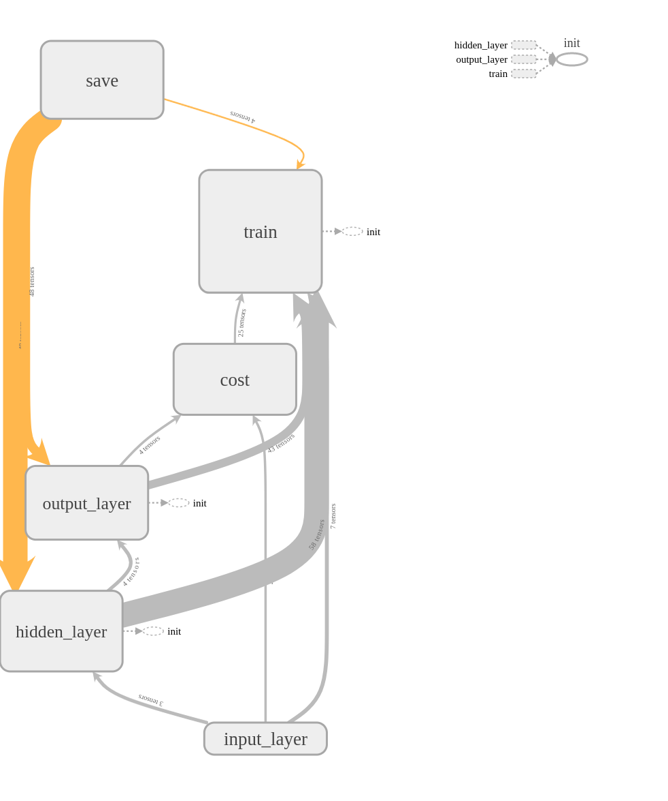
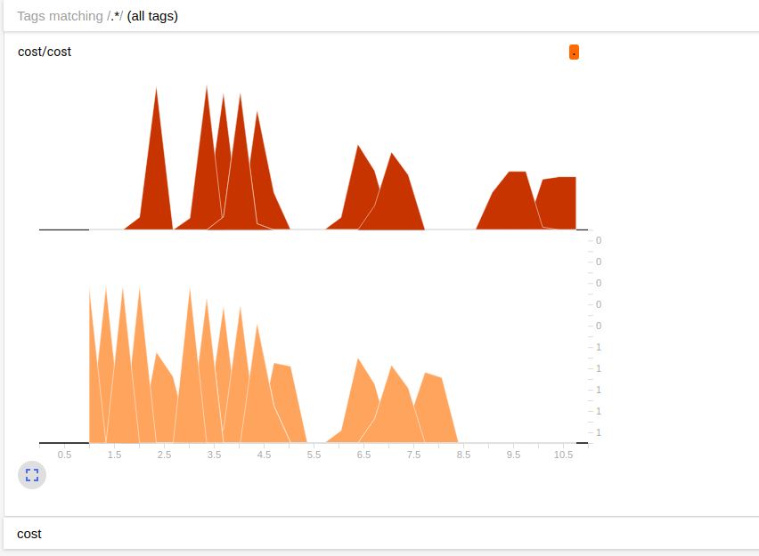
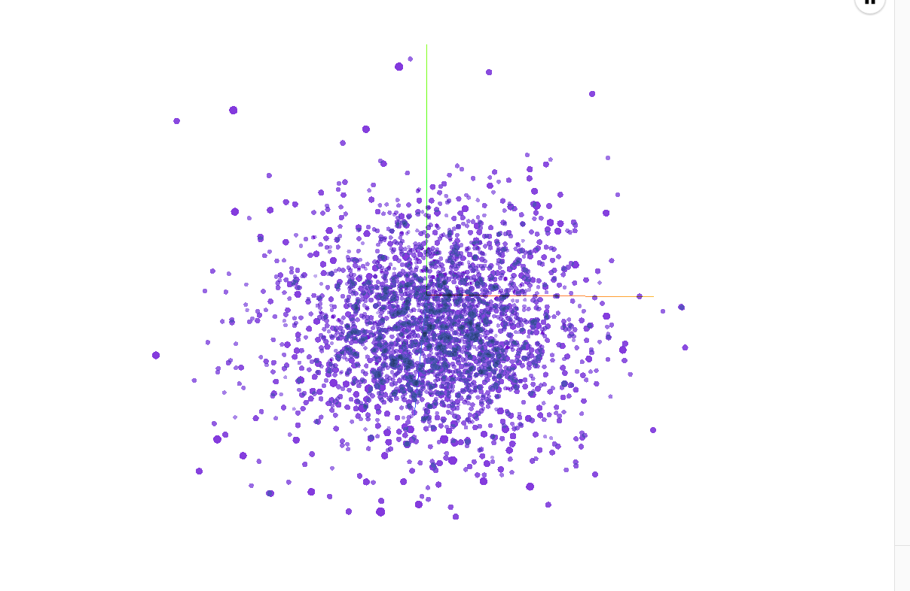

# Captcha 

## 统计数据　

**统计数据集总数、统计不同位数验证码的数量与所占比例**

| 验证码位数 | 验证码数量 |    比例    |
| :---: | :---: | :------: |
|   １   | 9844  |  0.2461  |
|   ２   | 5908  |  0.1477  |
|   ３   | 16183 | 0.404575 |
|   ４   | 8065  | 0.201625 |

---

## 将数据集制作成TFRecord文件 

**将数据集按照8:1:1比例划分为训练集、验证集与测试集**

---

## 设计模型 

 

* cnn 

* 三层卷积池化 

* 正则化 

* 增加四层输出       

  ​

##验证模型 

**每代训练500个样本，训练完全部样本五次加一个验证集**　

**训练集正确率：　0.9975**  

**验证集正确率：　0.92** 

**测试集正确率： 0.75** 

## 可视化　

### 损失

 

### project 

 

## Ｗeb Ａpi 　

**每次上传图片，读取`cnn`训练保存的模型，解析图片验证码，为了实现多次上传，将读取模型函数放到一个子进程中**

